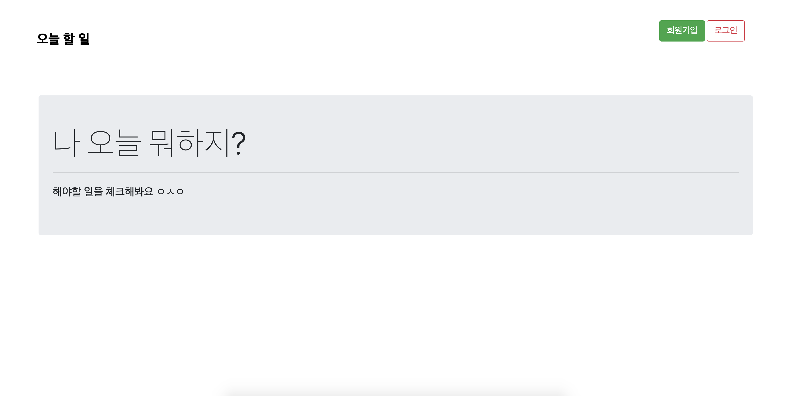
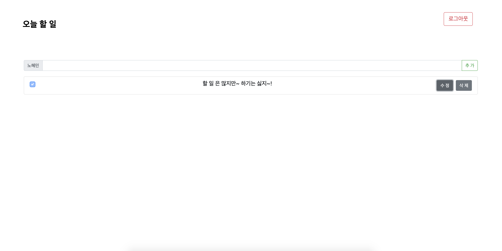

# Node.js Study

    🌱Node.js를 이용한 서비스 구축을 공부합니다 👩‍💻


## 🗂 전체 디렉토리 구조  

학습내용과 To-do List 웹을 구현한 폴더가 구분되어 있습니다.  

```zsh
    .
    ├── CreateHttpServer  --- Http 모듈 이해 실습
    ├── NPM-Test          --- NPM 활용 연습
    ├── TodoList          --- To-do List 웹 만들어보기
    ├── TutorialPractice  --- Javascript 및 node.js 간단한 실습 
    ├── express-test      --- express-generator 활용 
    ├── learn-mocha       --- TDD, SuperTest 실습
    ├── learn-mongoose    --- express와 mongoose 연동
    ├── learn-oauth       --- passport.js를 활용한 소셜로그인 실습
    └── screenshot
```

## 🖥 To-do List 웹   

학습한 내용을 바탕으로 `express`, `mongoose`와 `vue`를 활용한 To-do List 웹 구현  
(배포하지 않았기 때문에 빌드하지 않고 따로 실행하며 동작 확인만 함)

서버 실행
```
cd TodoList/backend && npm start
```

프론트 실행 
```
cd TodoList/frontend && npm run serve
```

<kbd></kbd>

<kbd></kbd>

### 🔍 참고

> * Node.js 교과서 - 조현영 지음
